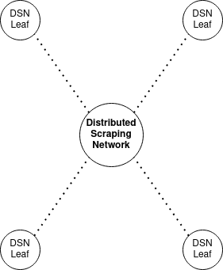

# Distributed Scraping Network

This API is created to run on a server, providing a central means of distributing and collecting 
weather data from [Open-Meteo](https://open-meteo.com/). 
This server provides a means of accessing and running a [DSN leaf](https://github.com/Spatiotemporal-Wildlife-Classification/DSN-Leaf)
node at any computer. This allows collection to occur externally running from a form of cloud computing. 
This allows you to keep your computer free to work on other topics while data collection occurs. 

This API is run in combination with results obtained from [Spatiotemporal Wildlife Classification](https://trav-d13.github.io/spatiotemporal_wildlife_classification/)
and [DSN Leaf](). The links provided will take you directly to their respective documentation. 

Please keep in mind that the DSN leaf should execute a total maximum of 10000 requests per day to Open-Meteo. 
Please respect the rate limits, and a thank you to the amazing service they provide. 

The API was created using [FastAPI](https://fastapi.tiangolo.com/)
